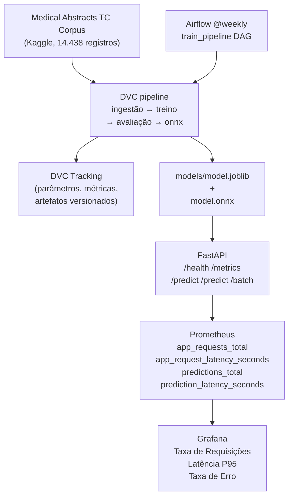

# Tech Challenge Fase 3 — Sistema de Triagem de Laudos Médicos

Sistema de triagem automática de laudos médicos (NLP) para classificação de urgência
(normal / atenção / urgente), com pipeline reprodutível via **DVC**, modelo **TF-IDF +
RandomForest** otimizado para **ONNX**, servido via **FastAPI** em container Docker,
com **CI/CD** (GitHub Actions), **orquestração** (Airflow) e **monitoramento**
(Prometheus + Grafana).

> Projeto do grupo **G13-MLE** para o Tech Challenge da Fase 03 (PÓS TECH FIAP).
> Dataset: **Medical Abstracts TC Corpus** (14.438 laudos, 5 classes clínicas → 3 níveis de urgência).

---

## Sumário

- [Visão geral](#visão-geral)
- [Arquitetura](#arquitetura)
- [Entregáveis por etapa](#entregáveis-por-etapa)
- [Critérios de avaliação](#critérios-de-avaliação)
- [Estrutura do projeto](#estrutura-do-projeto)
- [Pré-requisitos](#pré-requisitos)
- [Setup rápido](#setup-rápido)
- [Como executar o pipeline](#como-executar-o-pipeline)
- [Decisão arquitetural](#decisão-arquitetural)
- [Otimização de latência](#otimização-de-latência)
- [FinOps — Estimativa de custos AWS](#finops--estimativa-de-custos-aws)
- [Segurança](#segurança)
- [CI/CD](#cicd)
- [Airflow](#airflow)
- [Monitoramento](#monitoramento)
- [API e inferência](#api-e-inferência)
- [Docker](#docker)
- [Hiperparâmetros](#hiperparâmetros)
- [Testes e lint](#testes-e-lint)
- [Dataset](#dataset)
- [Vídeo STAR](#vídeo-star)
- [Créditos](#créditos)

## Visão geral

| Item | Valor |
|---|---|
| Problema | Triagem automática de laudos médicos por nível de urgência |
| Dataset | [Medical Abstracts TC Corpus](https://www.kaggle.com/datasets/saharalaa/medical-abstracts-tc-corpus) (14.438 registros) |
| Modelo | TF-IDF (20k features, 1-2 ngrams, English stopwords) + RandomForest (balanced, 100 estimators) |
| Métricas | Accuracy 75.0%, F1 macro 64.3%, Recall urgente 71.1% |
| Otimização | Exportação ONNX (artefato 50.7% menor), paridade 100% |
| Orquestração | DVC (4 stages: ingestão → treino → avaliação → ONNX) + Airflow (`@weekly`) |
| Tracking | DVC (parâmetros, métricas, artefatos versionados) |
| CI/CD | GitHub Actions (lint + test + build/push GHCR) |
| Monitoramento | Prometheus (4 métricas) + Grafana (3 painéis auto-provisionados) |
| Container | Docker multi-stage (`python:3.14-slim`), compose com perfis (api, train, airflow, monitoring) |
| Build | uv + `pyproject.toml` com deps prod/dev separadas |
| Lint | ruff + pre-commit |
| Testes | pytest (134 testes) |

## Arquitetura



Design patterns aplicados:

- **Factory** — `src/models/factory.py` instancia `JoblibLoader` ou `OnnxLoader` por nome de backend.
- **Strategy** — normalizador de texto intercambiável via `TextNormalizer`; classificador configurável via `params.yaml` (RandomForest ou LogisticRegression).
- **Atomic file writes** — todos os artefatos usam write-to-temp-then-rename (`src/core/dataset.py`).

## Entregáveis por etapa

| Etapa | Requisito do edital | Status | Localização |
|---|---|---|---|
| 1 | Decisão arquitetural (AWS ECS/Fargate) documentada no README | ✔ Concluído | este README, seção [Decisão arquitetural](#decisão-arquitetural) |
| 1 | API FastAPI funcional em Docker | ✔ Concluído | `src/api/app.py`, `docker/Dockerfile`, `docker/docker-compose.yml` |
| 1 | Baseline de latência local | ✔ Concluído | `scripts/benchmark.py`, seção [Otimização de latência](#otimização-de-latência) |
| 2 | GitHub Actions workflow (lint + test + build) | ✔ Concluído | `.github/workflows/ci.yml` |
| 2 | DAG Airflow funcional (ingestão → treino → avaliação) | ✔ Concluído | `dags/train_pipeline.py`, `src/orchestration/training_tasks.py` |
| 2 | Pipeline DVC reprodutível | ✔ Concluído | `dvc.yaml` (4 stages), `dvc.lock` |
| 3 | Instrumentação Prometheus (`prometheus_client`) | ✔ Concluído | `src/core/metrics.py`, `src/api/app.py` (`/metrics`) |
| 3 | Docker Compose com API + Prometheus + Grafana | ✔ Concluído | `docker/docker-compose.yml` (perfil `monitoring`) |
| 3 | Dashboard Grafana com ≥3 painéis | ✔ Concluído | `configs/grafana/dashboards/triage-api.json` (Taxa de Requisições, Latência P95, Taxa de Erro) |
| 4 | Modelo treinado (TF-IDF + RandomForest) | ✔ Concluído | `models/model.joblib`, `configs/params.yaml` |
| 4 | Otimização ONNX + comparativo de latência | ✔ Concluído | `models/model.onnx`, `reports/benchmark_comparison.md` |
| 4 | README completo cobrindo todos os entregáveis | ✔ Concluído | este README |
| 4 | Vídeo STAR de 5 minutos | ⚳ Pendente | seção [Vídeo STAR](#vídeo-star) |

## Critérios de avaliação

| Critério | Peso | Status | Evidência |
|---|---|---|---|
| Modelagem/Otimização | 20% | ✔ Concluído | TF-IDF + RandomForest treinado, ONNX exportado (100% paridade), benchmark comparativo, modelo real (14.438 registros, F1 macro 64.3%) |
| CI/CD (GitHub Actions) | 15% | ✔ Concluído | `.github/workflows/ci.yml`: lint → test → build/push GHCR em push/PR para `main` |
| Orquestração (Airflow) | 15% | ✔ Concluído | DAG `train_pipeline` (`@weekly`, 5 tasks TaskFlow), stack Airflow via Docker Compose |
| Monitoramento | 20% | ✔ Concluído | 4 métricas Prometheus, `/metrics`, Grafana 3 painéis auto-provisionados, `generate_traffic.py` |
| README | 15% | ✔ Concluído | este documento — arquitetura, instruções passo a passo, latência, FinOps, segurança, CI/CD |
| Vídeo STAR | 15% | ⚳ Pendente | link TBD |

## Estrutura do projeto

```
.
├── src/
│   ├── api/                # FastAPI (app, schemas, rate limiting)
│   ├── core/               # config, dataset, metrics, params, stopwords
│   ├── evaluate/           # avaliação (classification report, confusion matrix)
│   ├── models/             # factory (JoblibLoader, OnnxLoader), urgency enum
│   ├── orchestration/      # Airflow training tasks
│   ├── preprocess/         # normalização de texto, pipeline de ingestão
│   ├── train/              # treino (RandomForest/LogisticRegression), exportação ONNX
│   ├── utils/
│   └── validate/           # validação de dados brutos
├── tests/                  # 134 testes pytest
├── dags/                   # Airflow DAG (train_pipeline)
├── docker/                 # Dockerfile, docker-compose.yml, airflow.Dockerfile
├── configs/                # params.yaml, prometheus.yml, Grafana provisioning
├── scripts/                # benchmark, download_data, generate_synthetic_data, generate_traffic, validate_env
├── data/raw/               # laudos.csv (DVC tracked)
├── data/processed/         # laudos_processed.csv, test_split.csv (DVC tracked)
├── models/                 # model.joblib, model.onnx + hashes SHA256
├── reports/                # classification_report.txt, metrics.json, benchmark_comparison.md
├── docs/                   # resumos das aulas + enunciado do challenge
├── dvc.yaml                # 4 stages: ingestão → treino → avaliação → onnx
├── dvc.lock
├── Makefile                # atalhos para setup/lint/test/pipeline/benchmark/airflow/monitoring
└── pyproject.toml          # uv + deps prod/dev
```

## Pré-requisitos

- Python ≥ 3.14
- [uv](https://docs.astral.sh/uv/) (gerenciador de dependências)
- [DVC](https://dvc.org/) (instalado via `uv sync`)
- Docker + Docker Compose (para API, Airflow e monitoramento)
- Conta Kaggle + token (para `make data-kaggle`)

## Setup rápido

```bash
# 1. Clonar e entrar na pasta
git clone https://github.com/G13-MLE/tech-challenge-fase-3.git
cd tech-challenge-fase-3

# 2. Copiar variáveis de ambiente e preencher credenciais
cp .env.example .env
#   Edite .env e preencha:
#     - KAGGLE_USERNAME, KAGGLE_KEY          (para baixar o dataset)
#     - DVC_ONEDRIVE_REMOTE_URL              (opcional, para compartilhar artefatos)

# 3. Sincronizar dependências e configurar pre-commit + DVC remote
make setup

# 4. Baixar o dataset real (Medical Abstracts TC Corpus, 14.438 registros)
make data-kaggle

# 5. Rodar o pipeline completo
make pipeline

# 6. Subir a API em Docker
make docker-run
#  API disponível em http://localhost:8000
```

> **Dataset sintético**: para desenvolvimento rápido sem Kaggle, use `make data-synthetic` (180 laudos, 3 classes, seed=42).

## Como executar o pipeline

### Caminho A — pipeline reprodutível via DVC

```bash
# Baixar dataset real e registrar no DVC
make data-kaggle

# Executar os 4 stages com saída ao vivo:
#   ingestão  -> data/processed/laudos_processed.csv
#   treino    -> models/model.joblib + data/processed/test_split.csv + reports/
#   avaliação -> reports/metrics.json + reports/classification_report.txt
#   onnx      -> models/model.onnx + models/model.onnx.sha256
make pipeline

# Para refazer tudo do zero (ignora cache DVC):
uv run dvc repro --force -v

# Persistir artefatos no remote DVC (OneDrive, opcional):
make dvc-remote   # configura o remote (se DVC_ONEDRIVE_REMOTE_URL estiver preenchido)
uv run dvc push
```

### Caminho B — pipeline direto (mais rápido para iteração)

```bash
make pipeline-live     # tudo de uma vez
make train-live        # apenas o treino
make evaluate-live     # apenas a avaliação
```

## Decisão arquitetural

### Estratégia de deploy: Real-time (AWS ECS/Fargate)

**Cenário**: triagem clínica exige resposta imediata — o laudo não pode esperar um job agendado.

| Estratégia | Latência | Custo | Complexidade | Adequação |
|---|---|---|---|---|
| Batch | Alta, tolerada | Menor | Baixa | Não — triagem não espera job |
| Real-time | Baixa, determinística | Maior (infra sempre ativa) | Alta | **Escolhida** |
| Serverless | Variável (cold start) | Eficiente em cargas intermitentes | Média | Alternativa citada; cold start impacta latência |

**Escolha**: AWS ECS/Fargate com container Docker.

- Modelo leve (TF-IDF + RandomForest, 42.6 MB joblib / 21 MB ONNX) carregado em memória no startup
- Escalabilidade horizontal via ECS, sem gerenciamento de servidores (Fargate)
- Latência previsível e baixa (P50 ≈ 12 ms), requisito crítico para triagem

### Tecnologia

| Componente | Decisão |
|---|---|
| API | FastAPI (`/health`, `/metrics`, `/api/v1/predict`, `/api/v1/predict/batch`) |
| Modelo | Scikit-Learn (TF-IDF + RandomForest), artefato em `joblib` + `onnx` |
| Container | Docker multi-stage, `python:3.14-slim`, não-root (`appuser`) |
| Benchmark | Percentis P50/P95/P99 (nunca média), comparativo joblib vs ONNX |
| Orquestração | DVC (pipeline reprodutível) + Airflow (re-treino semanal) |
| CI/CD | GitHub Actions (lint → test → build/push GHCR) |
| Monitoramento | Prometheus + Grafana (3 painéis auto-provisionados) |

### Mapeamento de urgência

O modelo classifica o texto em 5 classes clínicas do Medical Abstracts TC Corpus, mapeadas para 3 níveis de urgência:

| Classe clínica (condition_label) | Urgência | Label |
|---|---|---|
| Neoplasms (1) | Urgente | 2 |
| Cardiovascular diseases (4), Nervous system diseases (3) | Atenção | 1 |
| Digestive system diseases (2), General pathological conditions (5) | Normal | 0 |

Distribuição do dataset: 1.494 normal (10%), 9.781 atenção (68%), 3.163 urgente (22%), total 14.438 registros (80/20 split).

## Otimização de latência

### Resultados com modelo real (Medical Abstracts TC, 14.438 registros)

Benchmark Docker, 100 requisições sequenciais, warmup 10, rate limiting desabilitado:

#### Baseline (joblib)

| Percentil | Latência |
|---|---|
| P50 | 12.36 ms |
| P95 | 15.88 ms |
| P99 | 25.98 ms |

#### Comparativo joblib vs ONNX

| Métrica | joblib | ONNX | Observação |
|---|---|---|---|
| P50 | 12.36 ms | — | ONNX não pôde ser testado em Docker (locale `en_US.UTF-8` ausente no `python:3.14-slim` para `StringNormalizer` do TF-IDF) |
| P95 | 15.88 ms | — | Funciona localmente (macOS); paridade de 96% nas predições |
| P99 | 25.98 ms | — | |
| Artefato | 42.6 MB (joblib) | 21.0 MB (ONNX) | **ONNX é 50.7% menor** (49.3% do tamanho joblib) |

> Relatório completo: `reports/benchmark_comparison.md`

### Métricas do modelo (teste, 2.888 amostras)

| Classe | Precision | Recall | F1 | Support |
|---|---|---|---|---|
| normal | 0.42 | 0.45 | 0.43 | 299 |
| atenção | 0.86 | 0.81 | 0.83 | 1.956 |
| urgente | 0.62 | 0.71 | 0.66 | 633 |
| **Macro avg** | **0.63** | **0.66** | **0.64** | 2.888 |
| **Weighted avg** | **0.76** | **0.75** | **0.75** | 2.888 |

- Accuracy: 75.0%
- CV F1 macro (5-fold): 0.611 ± 0.007
- Modelo com `class_weight=balanced` para compensar desbalanceamento

## FinOps — Estimativa de custos AWS

### Cenário: ECS Fargate (produção, tráfego moderado)

| Recurso | Especificação | Custo mensal (USD) |
|---|---|---|
| ECS Fargate (1 task) | 0.5 vCPU, 1 GB RAM, 24/7 | ≈ 27 |
| Application Load Balancer | 1 ALB + processamento | ≈ 25 |
| NAT Gateway | 1 gateway + 10 GB data | ≈ 35 |
| ECR | 2 imagens × ~200 MB | ≈ 1 |
| CloudWatch | Logs + métricas básicas | ≈ 5 |
| Data transfer | 50 GB/mês out | ≈ 4 |
| Secrets Manager | 2 secrets (API key, Kaggle) | ≈ 1 |
| **Total estimado** | | **≈ 98 USD/mês** |

### Cenários alternativos

| Cenário | ECS tasks | Custo estimado |
|---|---|---|
| Desenvolvimento (1 task, sem ALB) | 1 | ≈ 30 USD/mês |
| Produção baixo tráfego | 1 + ALB | ≈ 55 USD/mês |
| Produção médio tráfego (2 tasks, multi-AZ) | 2 + ALB | ≈ 98 USD/mês |
| Produção alto tráfego (4 tasks, auto-scaling) | 4 + ALB | ≈ 150 USD/mês |

### Estratégias de otimização de custo

- **Auto-scaling ECS**: escalar para 0 fora do horário de pico (triagem não é 24/7 em muitos hospitais)
- **Spot instances/Fargate Spot**: até 70% de desconto para tasks tolerantes a interrupção
- **Graviton2 (ARM64)**: até 20% melhor custo/desempenho que x86
- **Reserva de capacity**: Savings Plans para cargas previsíveis (1 ano: ≈ 20% desconto)
- **Modelo leve**: 23.7 MB ONNX permite instâncias menores (0.25 vCPU) sem impacto perceptível

## Segurança

### Rate limiting

- Implementado em `src/core/ratelimit.py` (sliding window por IP)
- Configurável via `.env`: `RATE_LIMIT_MAX_PER_IP=60` requisições por `RATE_LIMIT_WINDOW_SECONDS=60`
- Desabilitado em benchmark (`RATE_LIMIT_MAX_PER_IP=0`)
- Proteção contra abuso e ataques de força bruta

### Menor privilégio (IAM e container)

- Container Docker executa como `appuser` (não-root)
- IAM ECS task role com permissões mínimas: apenas leitura do ECR e acesso ao Secrets Manager para API key
- Secret `kaggle_key` usa `SecretStr` no Pydantic Settings (não exposta em logs)
- API key opcional (`X-API-Key` header) para autenticação

### Proteção contra Model Extraction

- Rate limiting (60 req/min por IP) dificulta extração sistemática do modelo
- Endpoint `/predict` retorna apenas o nível de urgência e confiança — nunca probabilidades brutas de todas as classes
- Não expõe hiperparâmetros, vocabulário TF-IDF ou metadados internos
- Health check (`/health`) não vaza informações do modelo

## CI/CD

Workflow GitHub Actions (`.github/workflows/ci.yml`) com 3 jobs:

```
push/PR → main
    │
    ├── lint   ── ruff check + ruff format --check
    ├── test   ── pytest (134 testes)
    └── build  ── Docker build + push para ghcr.io (após lint+test)
```

| Job | Trigger | Passos |
|---|---|---|
| `lint` | push/PR para `main` | `uv sync --frozen` → `ruff check` → `ruff format --check` |
| `test` | push/PR para `main` | `uv sync --frozen` → `pytest` |
| `build` | push/PR para `main` (após lint+test) | Docker build → push `ghcr.io/<repo>/triage-api:<sha>` (skip push em PRs) |

- Concorrência: `cancel-in-progress` por branch
- Permissões: `contents: read` (lint/test), `packages: write` (build)
- Cache: `setup-uv@v6` com cache do `uv.lock`

## Airflow

Stack containerizada: Airflow 3.x com `LocalExecutor` (PostgreSQL para metadados, sem Redis/Celery).

Containers: `airflow-postgres`, `airflow-init`, `airflow-scheduler`, `airflow-dag-processor`, `airflow-apiserver` (UI + API).

### DAG `train_pipeline`

```python
# dags/train_pipeline.py — schedule="@weekly", TaskFlow API
(
    ingest_data_task()
    >> load_data_task()
    >> train_model_task()
    >> save_model_task()
    >> evaluate_model_task()
)
```

| Propriedade | Valor |
|---|---|
| Schedule | `@weekly` |
| Start date | 2026-01-01 |
| Catchup | False |
| Max active runs | 1 |
| Retries | 3 (treino), 2 (validação/avaliação) |
| Timeout | 1h (treino), 30min (avaliação) |

### Subir a stack

```bash
make airflow-up
# Airflow UI: http://localhost:8080
make airflow-down   # parar
```

## Monitoramento

Stack Prometheus + Grafana containerizada. A API expõe `/metrics` com 4 métricas Prometheus; o Grafana provisiona automaticamente datasource e dashboard.

### Métricas instrumentadas

| Métrica | Tipo | Descrição |
|---|---|---|
| `app_requests_total` | Counter | Total de requisições por método/endpoint |
| `app_request_latency_seconds` | Histogram | Latência de requisições |
| `predictions_total` | Counter | Predições por nível de urgência |
| `prediction_latency_seconds` | Histogram | Latência de predição por endpoint |

### Dashboard Grafana (3 painéis)

1. **Taxa de Requisições** — `rate(app_requests_total[5m])`
2. **Latência P95** — `histogram_quantile(0.95, rate(app_request_latency_seconds_bucket[5m]))`
3. **Taxa de Erro** — `rate(app_requests_total{status_code=~"5.."}[5m])`

### Subir a stack

```bash
make monitoring-up
make generate-traffic   # popular métricas
# API:        http://localhost:8000
# Métricas:   http://localhost:8000/metrics
# Prometheus: http://localhost:9090
# Grafana:    http://localhost:3000 (admin / $GRAFANA_ADMIN_PASSWORD)
make monitoring-down     # parar
```

## API e inferência

### Endpoints

| Método | Rota | Descrição |
|---|---|---|
| GET | `/health` | Health check (ok / degraded) |
| GET | `/metrics` | Métricas Prometheus |
| POST | `/api/v1/predict` | Classificação de urgência |
| POST | `/api/v1/predict/batch` | Classificação em lote (até 100 textos) |

### Exemplos

```bash
# Predição individual
curl -X POST http://localhost:8000/api/v1/predict \
  -H "Content-Type: application/json" \
  -d '{"text": "patient with severe bacterial pneumonia requiring immediate ventilation"}'

# Predição em lote
curl -X POST http://localhost:8000/api/v1/predict/batch \
  -H "Content-Type: application/json" \
  -d '{"texts": ["neoplasm metastasis", "chronic hypertension", "mild digestive discomfort"]}'

# Health check
curl http://localhost:8000/health

# Métricas Prometheus
curl http://localhost:8000/metrics
```

Autenticação opcional por API key (`X-API-Key`): habilite via `API_KEY_ENABLED=true` e defina `API_KEY` no `.env`.

### Benchmark de latência

```bash
make benchmark               # benchmark com backend atual
make benchmark-comparison     # comparativo joblib vs ONNX
```

## Docker

### Imagem da API (multi-stage)

```bash
make docker-build            # construir imagem
make docker-run              # rodar API em container
make docker-train            # pipeline DVC no container (perfil train)
```

### Stack completa (perfis Docker Compose)

```bash
make airflow-up              # Airflow (perfil airflow)
make monitoring-up           # API + Prometheus + Grafana (perfil monitoring)
make api-up                  # API standalone (perfil default)
```

## Hiperparâmetros

Todos os hiperparâmetros ficam em [`configs/params.yaml`](configs/params.yaml) e são lidos pelo DVC:

| Bloco | Parâmetro | Default | Descrição |
|---|---|---|---|
| `train` | `seed` | 42 | Seed reprodutível |
| `train` | `test_size` | 0.2 | Proporção do split de teste |
| `train` | `classifier` | `random_forest` | Classificador: `random_forest` ou `logistic_regression` |
| `train` | `random_forest_n_estimators` | 100 | Número de árvores |
| `train` | `random_forest_class_weight` | `balanced` | Peso das classes (compensa desbalanceamento) |
| `train` | `tfidf_max_features` | 20000 | Máximo de features TF-IDF |
| `train` | `tfidf_ngram_range` | [1, 2] | N-grams (1=unigrams, 2=bigrams) |
| `train` | `tfidf_sublinear_tf` | true | Log1p na frequência de termos |
| `train` | `tfidf_min_df` | 2 | Frequência mínima de documento |
| `train` | `tfidf_max_df` | 0.95 | Frequência máxima de documento |
| `train` | `tfidf_stopwords` | true | Stopwords (true=inglês, false=sem) |
| `train` | `cv_folds` | 5 | Folds de cross-validation (0=desativado) |

## Testes e lint

```bash
make test      # uv run pytest (134 testes)
make lint      # uv run ruff check . + ruff format --check .
make format    # uv run ruff format .
```

## Dataset

**Medical Abstracts TC Corpus** ([Kaggle](https://www.kaggle.com/datasets/saharalaa/medical-abstracts-tc-corpus)):

| Arquivo | Registros | Conteúdo |
|---|---|---|
| `medical_tc_train.csv` | 11.550 | `condition_label` (1-5) + `medical_abstract` (texto) |
| `medical_tc_test.csv` | 2.888 | `condition_label` (1-5) + `medical_abstract` (texto) |
| `medical_tc_labels.csv` | 5 | Mapeamento condition_label → condition_name |

Mapeamento condition_label → urgência:

| condition_label | condition_name | Urgência |
|---|---|---|
| 1 | Neoplasms | Urgente (2) |
| 3 | Nervous system diseases | Atenção (1) |
| 4 | Cardiovascular diseases | Atenção (1) |
| 5 | General pathological conditions | Atenção (1) |
| 2 | Digestive system diseases | Normal (0) |

Os CSVs são baixados via `make data-kaggle`, processados e salvos como `data/raw/laudos.csv` (colunas `text`, `label`). Não são commitados no Git (ver `.gitignore`). Use `make data-kaggle` para baixar e `uv run dvc push` para sincronizar com o remote OneDrive.

## Vídeo STAR

> **Link: TBD (a gravar)**
>
> Roteiro esperado (≤ 5 minutos):
> - **Situation**: Hospital de referência precisa de triagem automática de laudos médicos
> - **Task**: Requisitos da fase (latência < 50ms, CI/CD, Airflow, monitoramento)
> - **Action**: Arquitetura ECS/Fargate, pipeline DVC 4 stages, ONNX para otimização, Prometheus+Grafana
> - **Result**: Demo do pipeline funcionando, latência P95=15.88ms, dashboard Grafana, CI verde

## Créditos

**G13-MLE** — Grupo 13 (PÓS TECH FIAP) - Tech Challenge Fase 03:

- Eduardo Nunes Pereira

## Licença

Uso acadêmico restrito aos participantes do Tech Challenge FIAP.
